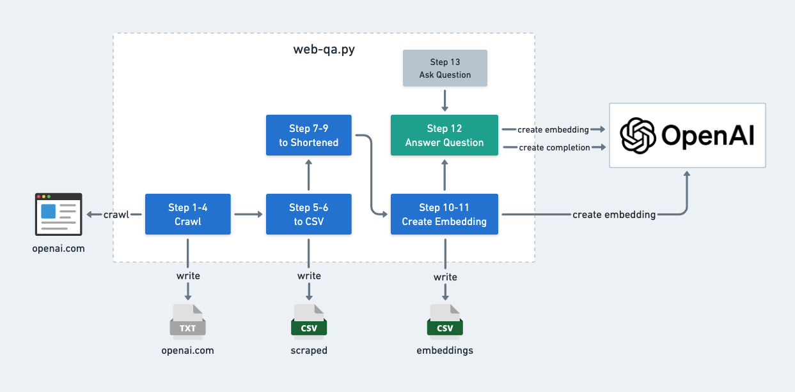

# Web  Q&A with Embeddings

Learn how to crawl your website and build a Q/A bot with the OpenAI API. You can find the full tutorial in the [OpenAI documentation](https://platform.openai.com/docs/tutorials/web-qa-embeddings).
